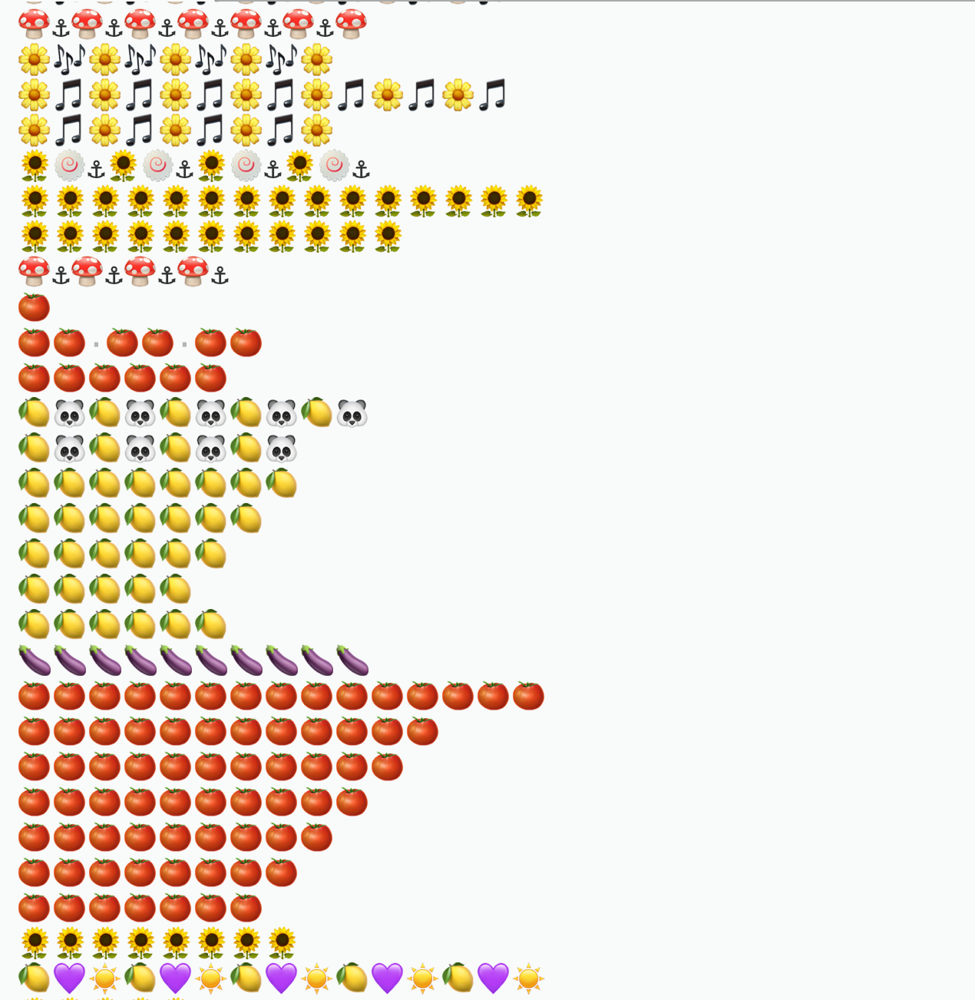

# 黑名单挖掘
鉴于 [3Shain](https://gist.github.com/3Shain) 正在开发[对抗脚本的脚本](https://gist.github.com/3Shain/e831b4b15999600994521c59e6f98708)，并且其中需要脚本已经控制的黑名单，这个简单的程序的作用就是从 [VTB/VUP DD](https://github.com/bilibili-dd-center) 的 [bilibili-vtuber-danmaku](https://github.com/bilibili-dd-center/bilibili-vtuber-danmaku) 数据库中找出 3Shain 脚本中需要的黑名单

整个流程分为两步：
1. 找出脚本哥发的弹幕
2. 找到那些弹幕对应的UID

第一步，如果仔细思考脚本哥的行为模式，他实际上是使用某种脚本，操作有限的观众账号，在非常短的时间内发送**大量的重复的弹幕**。所以，一个思路就是先找出那些在短时间内发送很多次的弹幕，再人工筛选出脚本哥发过的弹幕。

因为弹幕的数据已经包含了时间戳，整个事情变得非常简单：用一个时长为两秒的滑动窗口来滑过数据，每次只关注这个滑动窗口之中包含的弹幕，并且计算这些弹幕出现的次数。如果某个弹幕出现的次数超过了5次，那么我们就把它记录下来。

你可以下载本仓库里的代码，然后把来自 [VTB/VUP DD](https://github.com/bilibili-dd-center) 的数据库和代码放进同一个文件夹下，用python3运行：

```
python3 Filter_construct.py True
```

⚠️注意⚠️运行这个程序要花费数个小时。

Fashion_message.txt 包含了程序运行的结果，所以你不必自己去运行上面的程序。

第二步，通过阅读Fashion_message.txt, 我们可以手动找出脚本哥发过的弹幕。之后，在把所有发过那些弹幕的UID找出来就可以了。运行以下命令即可：

```
python3 Filter_construct.py False
```

结果已经存在UID.txt里，或者如下图：

<p>
    
</p>

之前3Shain的脚本里的黑名单有88个UID，大概是手动添加（？）。然后通过这个方法找出来的有187个UID bravo！

# 令人生草的副产品

大家其实可以仔细研究一下Fashion_message.txt里面的结果，如上图所示，非常生草，而且充满了熟悉感。

<p>
    
</p>

如图，弹幕按照出现的频率排序，排名第一的是888888，第二是无情的生草机器，第三是问号，第四第五才是dd们说的最多的“kksk”和“awsl”。
除此之外，很有意思的一点就是，类型相同的评论出现的频率都差不多，如下：

<p>
    
</p>


<p>
    
</p>

感觉这个其实是有某种规律在里面的，深挖的话说不定很有趣。我觉得离制作出非常真实的自动炒热气氛的弹幕机器人已经不远了......

顺便，如果某种程序检测到了短时间内大量发送的相同弹幕，而那种弹幕又不在Fashion_message.txt这个列表里，那么那种弹幕源于脚本哥的概率就会提升......这也算是一种过滤弹幕的思路。
